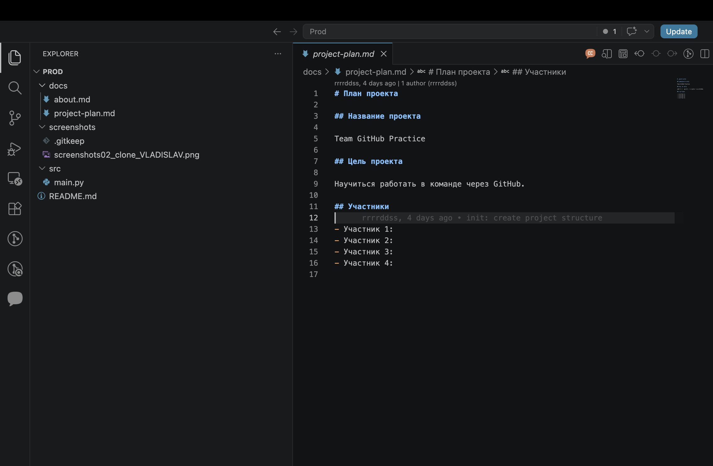
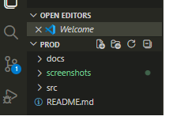
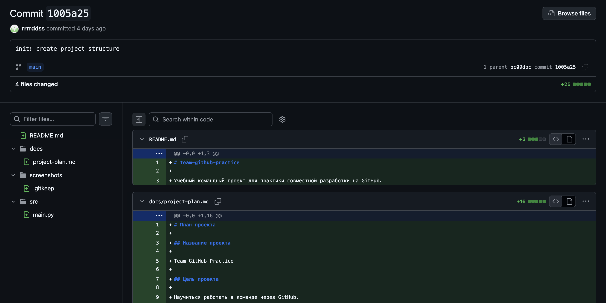
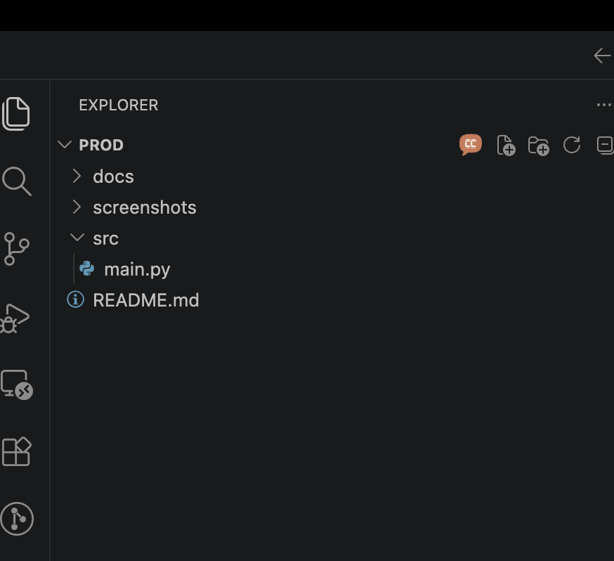

# Практическая работа: совместная разработка на GitHub

## Состав команды

| Участник | GitHub | Роль |
|---|---|---|
| ФИО | rrrrddss | Владелец репозитория |
| ФИО | Momb | Разработчик (about) |
| ФИО | honorkriminal | Разработчик (features) |
| ФИО | skyblack94143 | Проверяющий (contacts) |

## Цель работы

Научиться работать над одним проектом в команде через GitHub: добавлять участников,
клонировать общий проект, создавать коммиты, отправлять и получать изменения, работать
с ветками, создавать Pull Request и разрешать конфликты слияния.

## Используемые инструменты

- Git;
- GitHub;
- VS Code.

## Ход работы

### 1. Создание репозитория и добавление участников

Участник 1 создал публичный репозиторий `team-github-practice` с файлом `README.md`.
В разделе `Settings → Collaborators` были добавлены остальные участники команды по их
GitHub-логинам. Каждый участник принял приглашение и получил доступ к репозиторию.


Рисунок 1 — Добавление участников в репозиторий

### 2. Клонирование проекта

Каждый участник склонировал репозиторий через VS Code (`Source Control → Clone Repository`)
и открыл проект у себя на компьютере. У всех корректно открылся общий проект с `README.md`.



Рисунок 2 — Клонирование проекта участником 1



Рисунок 2.1 — Клонирование проекта участником команды

### 3. Первый push

Участник 1 создал структуру проекта (`docs/project-plan.md`, `src/main.py`, папку
`screenshots/`), сделал коммит `init: create project structure` и отправил изменения
на GitHub.



Рисунок 3 — Успешный первый push

### 4. Работа с изменениями других участников

После первого push остальные участники выполнили Pull и получили структуру проекта.
Затем участники создали свои файлы в разных папках, поэтому конфликтов не возникло:

- Участник 2 создал `docs/about.md` (коммит `docs: add about section`);
- Участник 3 создал `docs/features.md` (коммит `docs: add features section`);
- Участник 4 создал `docs/contacts.md` (коммит `docs: add contacts section`).

После этого каждый выполнил Pull и получил файлы остальных участников.



Рисунок 4 — Получение изменений после Pull

### 5. Ошибка при Push без Pull

Участник 2 добавил в `README.md` раздел «Описание» и отправил изменения на GitHub.
Участник 3 не сделал Pull, работал со старой версией файла и при попытке Push получил
отказ — в удалённом репозитории уже были новые изменения.

**Решение:** участник 3 выполнил Pull, объединил изменения с изменениями участника 2,
убедился, что его правки не потерялись, и повторно выполнил Push.

#### Проблема: забыли сделать Pull

Мы увидели, что если участник работает со старой версией проекта, Git может не разрешить
отправить изменения сразу. Сначала нужно получить актуальную версию с GitHub, объединить
изменения и только потом отправлять свои.

### 6. Merge conflict

Все участники сделали Pull. Участник 1 добавил в `README.md` раздел «Статус проекта»
со строкой «Проект находится в разработке.». Затем участник 2 и участник 3 изменили
**одну и ту же строку** по-разному и попытались отправить изменения — возник конфликт:

```
<<<<<<< HEAD
Проект находится на этапе тестирования совместной работы.
=======
Проект находится в активной разработке командой студентов.
>>>>>>> origin/main
```

Команда обсудила варианты, удалила служебные строки конфликта и объединила правки в одну
строку. Затем был сделан коммит `fix: resolve README merge conflict` и выполнен Push.

#### Проблема: merge conflict

Мы получили конфликт, потому что два участника изменили одну и ту же строку в `README.md`.
Git не смог автоматически выбрать правильный вариант, поэтому мы вручную объединили
изменения.

### 7. Работа с ветками

Чтобы не работать напрямую в `main`, участники создавали отдельные ветки и вносили
изменения в них:

- `feature/about-page` — расширение `docs/about.md`;
- `feature/features-page` — расширение `docs/features.md`;
- `feature/contacts-page` — расширение `docs/contacts.md`.

Ветка `main` оставалась стабильной версией, новые изменения готовились в отдельных ветках.

### 8. Pull Request

Каждый участник создал Pull Request из своей ветки в `main` с описанием того, что сделано
и что нужно проверить. Назначенный проверяющий из команды открывал вкладку `Files changed`,
оставлял комментарий и подтверждал, что изменения можно объединять. После проверки владелец
репозитория или автор Pull Request выполнял Merge.

### 9. Конфликт в Pull Request

Участники 2 и 3 создали ветки `feature/team-rules-a` и `feature/team-rules-b` и изменили
один и тот же участок файла `docs/project-plan.md`. Сначала был объединён Pull Request
участника 2. После этого Pull Request участника 3 показал конфликт с `main`. Команда
разрешила конфликт, объединив оба правила в общий раздел «Правила команды», и сделала
коммит `fix: resolve project plan conflict`.

### 10. Fetch и Pull

Участник 1 добавил в `README.md` раздел «Версия проекта» и отправил изменения. Остальные
участники выполнили не Pull, а Fetch и увидели, что на GitHub появились новые изменения,
но локальные файлы не обновились. После этого все выполнили Pull и получили изменения.

#### Разница между Fetch и Pull

Fetch позволяет увидеть, что на GitHub появились новые изменения, но не применяет их сразу
к локальным файлам. Pull получает изменения и сразу объединяет их с текущей рабочей версией.

## История коммитов

Минимальное требование (≥12 коммитов) выполнено. Основные коммиты проекта:

```
init: create project structure
docs: add about section
docs: add features section
docs: add contacts section
docs: add project description
docs: add project status
fix: resolve README merge conflict
docs: expand about page
docs: expand features page
docs: expand contacts page
docs: add team rule from participant 2
docs: add team rule from participant 3
fix: resolve project plan conflict
docs: add project version
```

## Вывод

В ходе практической работы команда научилась совместно вести один проект на GitHub.
Получилось настроить общий доступ, клонировать проект, обмениваться изменениями через
Push и Pull, работать в отдельных ветках и объединять их через Pull Request.

Самыми сложными оказались ситуации с конфликтами: когда два участника меняли одну и ту же
строку, Git не мог сам выбрать вариант, и приходилось разрешать конфликт вручную. Мы поняли,
зачем нужны ветки и Pull Request — они позволяют готовить изменения отдельно от стабильной
версии и проверять их перед объединением. Также стало понятно, почему важно делать Pull
перед началом работы: это избавляет от лишних конфликтов и потери изменений.

## Контрольные вопросы

1. **Что такое репозиторий?** — Хранилище проекта со всеми файлами и историей их изменений.
2. **Чем локальный репозиторий отличается от удалённого?** — Локальный находится на компьютере
   участника, удалённый — на сервере GitHub и общий для всей команды.
3. **Что делает команда Pull?** — Получает изменения с удалённого репозитория и сразу
   объединяет их с локальной версией.
4. **Что делает команда Push?** — Отправляет локальные коммиты в удалённый репозиторий.
5. **Чем Fetch отличается от Pull?** — Fetch только загружает информацию о новых изменениях,
   но не применяет их; Pull загружает и сразу объединяет с рабочей версией.
6. **Что такое ветка?** — Отдельная линия разработки, где можно вносить изменения, не затрагивая
   стабильную версию проекта.
7. **Почему не всегда удобно работать сразу в main?** — Изменения в `main` сразу влияют на
   стабильную версию и на всех участников; ошибки могут сломать общий проект.
8. **Что такое Pull Request?** — Запрос на объединение изменений из одной ветки в другую с
   возможностью обсуждения и проверки.
9. **Зачем нужна проверка Pull Request другим участником?** — Чтобы найти ошибки, повысить
   качество кода и убедиться, что изменения можно безопасно объединять.
10. **Что такое merge conflict?** — Ситуация, когда Git не может автоматически объединить
    изменения, потому что они затрагивают один и тот же участок файла.
11. **Почему возникает merge conflict?** — Когда два участника изменили одну и ту же строку
    одного и того же файла по-разному.
12. **Как понять, какой вариант кода оставить при конфликте?** — Команда обсуждает варианты и
    выбирает правильный или объединяет оба, удаляя служебные метки конфликта.
13. **Что будет, если забыть сделать Pull перед началом работы?** — Можно начать работу со
    старой версией, получить отказ при Push и лишние конфликты.
14. **Почему коммиты должны быть маленькими и понятными?** — Так проще понять историю изменений,
    найти ошибку и откатить нужное изменение.
15. **Что было самым сложным в этой практической работе?** — Разрешение конфликтов слияния,
    когда нужно было вручную объединять изменения двух участников.
