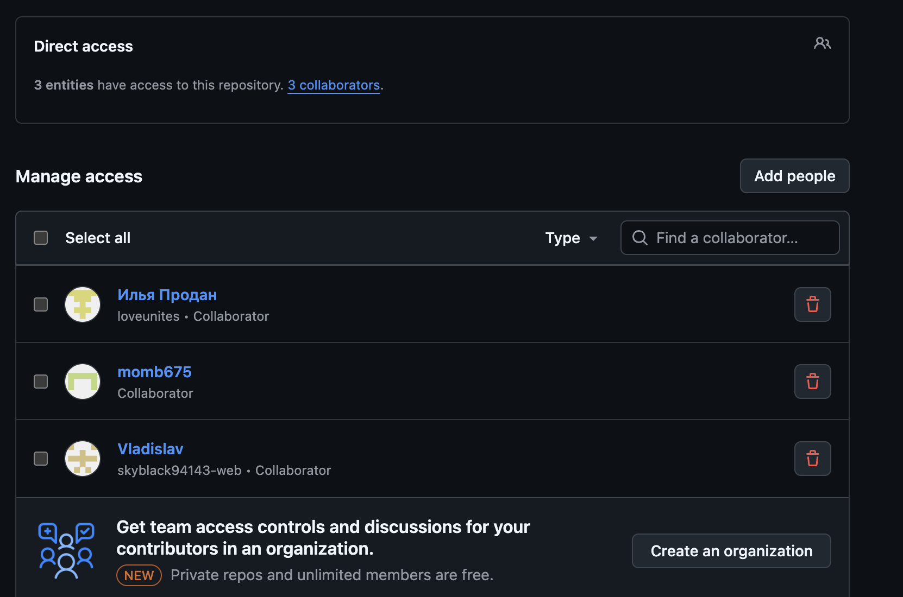

# Практическая работа: совместная разработка на GitHub

## Состав команды

| Участник | GitHub | Роль |
|---|---|---|
| ФИО | rrrrddss | Владелец репозитория |
| ФИО | username | Разработчик |
| Продан Илья | loveunites | Разработчик |
| ФИО | username | Проверяющий |

## Цель работы

Научиться работать над одним проектом в команде и на практике освоить совместную
разработку через GitHub: добавление участников, клонирование, коммиты, push, pull,
fetch, работу с ветками, pull request и разрешение конфликтов.

## Используемые инструменты

- Git;
- GitHub;
- VS Code.

## Ход работы

### 1. Создание репозитория и добавление участников

Участник 1 создал репозиторий и добавил остальных участников через Settings → Collaborators.

### 2. Клонирование проекта

Каждый участник склонировал проект через VS Code (Clone Repository).

### 3. Первый push

Участник 1 создал структуру проекта (`docs/`, `src/`, `screenshots/`), добавил
`src/main.py` и `docs/project-plan.md`, сделал коммит `init: create project structure`
и отправил изменения на GitHub.

### 4. Работа с изменениями других участников

Описать, кто какие файлы создал.

### 5. Ошибка при Push без Pull

Описать проблему и решение.

## Проблема: забыли сделать Pull

Мы увидели, что если участник работает со старой версией проекта, Git может не
разрешить отправить изменения сразу. Сначала нужно получить актуальную версию
с GitHub, объединить изменения и только потом отправлять свои.

### 6. Merge conflict

Описать, как появился конфликт и как команда его решила.

## Проблема: merge conflict

Мы получили конфликт, потому что два участника изменили одну и ту же строку в
README.md. Git не смог автоматически выбрать правильный вариант, поэтому мы
вручную объединили изменения.

### 7. Работа с ветками

Описать, какие ветки были созданы.

### 8. Pull Request

Описать, кто создал Pull Request и кто проверял.

### 9. Конфликт в Pull Request

Описать проблему и итоговое решение.

### 10. Fetch и Pull

Описать разницу между Fetch и Pull.

## Разница между Fetch и Pull

Fetch позволяет увидеть, что на GitHub появились новые изменения, но не применяет
их сразу к локальным файлам. Pull получает изменения и сразу объединяет их с
текущей рабочей версией.

## Статус проекта

Проект находится на этапе тестирования совместной работы.

## Версия проекта

Текущая версия: 1.0.0

## История коммитов

Вставить скриншот истории коммитов.

## Вывод

Написать общий вывод команды:

- что получилось;
- какие проблемы возникли;
- что было самым сложным;
- зачем нужны ветки и Pull Request;
- почему важно делать Pull перед началом работы.

## Контрольные вопросы

1. **Что такое репозиторий?** — Хранилище проекта со всеми файлами и историей изменений.
2. **Чем локальный репозиторий отличается от удаленного?** — Локальный находится на компьютере участника, удаленный — на сервере GitHub и доступен всей команде.
3. **Что делает команда Pull?** — Получает изменения с удаленного репозитория и объединяет их с локальной версией.
4. **Что делает команда Push?** — Отправляет локальные коммиты на удаленный репозиторий.
5. **Чем Fetch отличается от Pull?** — Fetch только загружает информацию об изменениях, не объединяя их; Pull загружает и сразу объединяет.
6. **Что такое ветка?** — Отдельная линия разработки, не затрагивающая стабильную версию `main`.
7. **Почему не всегда удобно работать сразу в main?** — Можно сломать стабильную версию и помешать другим участникам; ветки изолируют работу.
8. **Что такое Pull Request?** — Запрос на объединение изменений из ветки в `main` с возможностью проверки.
9. **Зачем нужна проверка Pull Request другим участником?** — Чтобы найти ошибки и убедиться в качестве изменений до слияния.
10. **Что такое merge conflict?** — Ситуация, когда Git не может автоматически объединить изменения в одном и том же месте файла.
11. **Почему возникает merge conflict?** — Когда два участника меняют один и тот же участок одного и того же файла.
12. **Как понять, какой вариант кода оставить при конфликте?** — Команда обсуждает варианты и вручную объединяет их в правильный итоговый результат.
13. **Что будет, если забыть сделать Pull перед началом работы?** — Можно работать со старой версией, и Git не примет push, пока не получишь актуальные изменения.
14. **Почему коммиты должны быть маленькими и понятными?** — Так легче понимать историю изменений и находить ошибки.
15. **Что было самым сложным в этой практической работе?** — Разрешение конфликтов при слиянии изменений.

## Используемые инструменты

-Git;
-GitHub;
-VS Code.

## Проблема: merge conflict

Мы получили конфликт, потому что два участника изменили одну и ту же строку в 
README.md. Git не смог автоматически выбрать правильный вариант, поэтому мы 
вручную объединили изменения.